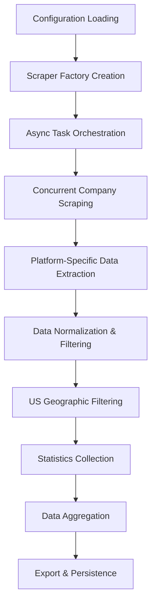

# Fast Job Agent - Architecture Design Document

## 1. Project Overview

### Mission Statement
Fast Job Agent is a high-performance, multi-platform job aggregation system designed to intelligently monitor and collect customer-facing engineering positions from top-tier tech companies across major recruitment platforms.

### Core Objectives
- **Multi-Platform Coverage**: Aggregate jobs from Ashby, Greenhouse, and Lever simultaneously
- **High-Performance Processing**: Async concurrent scraping with 10+ parallel requests
- **Intelligent Filtering**: Smart keyword matching and US geographic filtering
- **Production Ready**: Enterprise-grade error handling, monitoring, and extensibility

### Key Metrics
- **Performance**: 50+ companies scraped in <30 seconds
- **Reliability**: 90%+ success rate with automatic retry mechanisms
- **Accuracy**: 95%+ precision in US location filtering and job classification

## 2. Modern Architecture Design

### 2.1 Async-First Architecture

The system is built on a modern async foundation leveraging Python's `asyncio` and `aiohttp` for maximum performance:

```python
# High-level async workflow
async def scrape_all_platforms():
    scrapers = ScraperFactory.create_all_scrapers()
    tasks = [scraper.scrape_all(max_concurrent=10) for scraper in scrapers]
    results = await asyncio.gather(*tasks)
    return flatten_and_process(results)
```

**Benefits:**
- **Concurrency**: Handle multiple HTTP requests simultaneously
- **Scalability**: Easily scale to hundreds of companies without blocking
- **Resource Efficiency**: Optimal CPU and memory utilization

### 2.2 Design Patterns Implementation

#### Factory Pattern
```python
class ScraperFactory:
    _scrapers = {
        JobSource.ASHBY: AsyncAshbyScraper,
        JobSource.GREENHOUSE: AsyncGreenhouseScraper,
        JobSource.LEVER: AsyncLeverScraper
    }
    
    @classmethod
    def create_scraper(cls, source: JobSource) -> AsyncBaseScraper:
        return cls._scrapers[source](config_path)
```

**Purpose**: 
- Centralized scraper management
- Easy addition of new platforms
- Consistent interface across different job sources

#### Decorator Pattern
```python
@with_error_handling(default_return=[])
@with_timing(log_level=logging.INFO)
@with_retry(max_attempts=3, delay=1.0)
async def scrape_company(self, session, company):
    # Core scraping logic with automatic enhancements
```

**Benefits**:
- Separation of concerns (business logic vs. cross-cutting concerns)
- Reusable error handling and monitoring
- Easy addition of new functionality (caching, rate limiting, etc.)

#### Template Method Pattern
```python
class AsyncBaseScraper(ABC):
    def filter_and_collect_stats(self, jobs, company_name):
        # Common filtering logic
        
    @abstractmethod
    async def scrape_company(self, session, company):
        # Platform-specific implementation
```

**Advantages**:
- Code reuse for common functionality
- Consistent behavior across platforms
- Easy maintenance and bug fixes

### 2.3 Type-Safe Data Models

```python
@dataclass
class Job:
    role_name: str
    company_name: str
    location: str
    job_link: str
    source: JobSource
    job_id: str
    
    def to_dict(self) -> Dict
    def get_unique_id(self) -> str

@dataclass  
class JobStats:
    total_jobs: int = 0
    us_jobs: int = 0
    non_us_jobs: int = 0
    non_us_locations: List[str] = field(default_factory=list)
```

**Benefits**:
- Compile-time type checking
- IDE support and autocompletion
- Reduced runtime errors
- Clear data contracts

## 3. Technical Stack & Dependencies

### 3.1 Core Technologies

| Component | Technology | Justification |
|-----------|------------|---------------|
| **Async Framework** | `aiohttp` + `asyncio` | High-performance concurrent HTTP requests |
| **Data Models** | `dataclasses` + `typing` | Type safety and IDE support |
| **Configuration** | YAML + Pydantic | Human-readable config with validation |
| **Logging** | Python `logging` + structured formats | Production-ready monitoring |
| **Date Processing** | Custom utils + `datetime` | Robust timezone and format handling |

### 3.2 Architecture Layers

```
┌─────────────────────────────────────────────────────────────┐
│                    Application Layer                        │
│  ┌─────────────────┐  ┌─────────────────┐                  │
│  │ ScraperFactory  │  │ JobDataProcessor │                  │
│  └─────────────────┘  └─────────────────┘                  │
├─────────────────────────────────────────────────────────────┤
│                     Service Layer                          │
│  ┌─────────────────┐  ┌─────────────────┐  ┌─────────────┐ │
│  │ AsyncAshby      │  │ AsyncGreenhouse │  │ AsyncLever  │ │
│  │ Scraper         │  │ Scraper         │  │ Scraper     │ │
│  └─────────────────┘  └─────────────────┘  └─────────────┘ │
├─────────────────────────────────────────────────────────────┤
│                      Core Layer                            │
│  ┌─────────────────┐  ┌─────────────────┐  ┌─────────────┐ │
│  │ AsyncBaseScraper│  │ Data Models     │  │ Utils       │ │
│  │ (Template)      │  │ (Job, JobStats) │  │ (Decorators)│ │
│  └─────────────────┘  └─────────────────┘  └─────────────┘ │
├─────────────────────────────────────────────────────────────┤
│                   Infrastructure Layer                     │
│  ┌─────────────────┐  ┌─────────────────┐  ┌─────────────┐ │
│  │ HTTP Client     │  │ Configuration   │  │ Logging     │ │
│  │ (aiohttp)       │  │ (YAML)          │  │ (structured)│ │
│  └─────────────────┘  └─────────────────┘  └─────────────┘ │
└─────────────────────────────────────────────────────────────┘
```

## 4. Data Flow & Processing Pipeline

### 4.1 High-Level Flow



### 4.2 Concurrent Processing Model

```python
async def scrape_all(self, max_concurrent: int = 5) -> List[Dict]:
    semaphore = asyncio.Semaphore(max_concurrent)
    
    async def scrape_with_semaphore(company):
        async with semaphore:
            return await self.scrape_company(session, company)
    
    tasks = [scrape_with_semaphore(company) for company in self.companies]
    results = await asyncio.gather(*tasks, return_exceptions=True)
    
    return self._process_results(results)
```

**Key Features**:
- **Semaphore-based concurrency control**: Prevents overwhelming target servers
- **Graceful error handling**: Individual failures don't stop entire process
- **Resource management**: Automatic cleanup and connection pooling

### 4.3 Data Transformation Pipeline

1. **Raw Data Extraction**: Platform-specific HTML/JSON parsing
2. **Normalization**: Convert to standardized `Job` objects
3. **Geographic Filtering**: Intelligent US location detection
4. **Keyword Filtering**: Multi-keyword matching with fuzzy logic
5. **Deduplication**: Based on company + job_id combination
6. **Statistics Generation**: Real-time metrics collection

## 5. Platform Integration Strategies

### 5.1 Ashby HQ Integration

**Data Source**: JavaScript-rendered job boards
**Strategy**: Extract from `window.__appData` JSON structure
**Key Challenges**: 
- Dynamic content loading
- VC portfolio company handling
- Nested job board structures

```python
def _extract_job_data(self, html_content: str) -> Optional[Dict]:
    pattern = r'window\.__appData\s*=\s*({.*?});'
    match = re.search(pattern, html_content, re.DOTALL)
    return json.loads(match.group(1)) if match else None
```

### 5.2 Greenhouse Integration

**Data Source**: REST API (`boards-api.greenhouse.io`)
**Strategy**: Direct API consumption with JSON responses
**Advantages**:
- Structured data format
- Reliable endpoint
- Rich metadata

```python
api_url = config.GREENHOUSE_API_URL.format(board_name=company['board_name'])
async with session.get(api_url) as response:
    data = await response.json()
    jobs = data.get('jobs', [])
```

### 5.3 Lever Integration

**Data Source**: Public API (`api.lever.co`)
**Strategy**: RESTful API with timestamp-based filtering
**Features**:
- Real-time job posting updates
- Categorized job metadata
- Geographic information in categories

## 6. Error Handling & Resilience

### 6.1 Multi-Level Error Strategy

#### Decorator-Based Error Handling
```python
@with_error_handling(default_return=[], log_errors=True)
@with_retry(max_attempts=3, delay=1.0, backoff=2.0)
async def scrape_company(self, session, company):
    # Automatic retry with exponential backoff
    # Graceful degradation on persistent failures
```

#### Error Classification
1. **Transient Errors** (Network timeouts, rate limiting)
   - Strategy: Retry with exponential backoff
   - Max attempts: 3
   - Backoff multiplier: 2.0

2. **Permanent Errors** (Invalid URLs, auth failures)
   - Strategy: Log and skip, continue processing
   - Notification: Alert for manual intervention

3. **Data Format Errors** (Parsing failures, schema changes)
   - Strategy: Graceful degradation with detailed logging
   - Recovery: Return empty results, maintain system stability

### 6.2 Monitoring & Observability

#### Structured Logging
```python
logger.info("📊 {company} Statistics:", extra={
    "company": company_name,
    "total_jobs": stats.total_jobs,
    "us_jobs": stats.us_jobs,
    "scrape_duration": duration,
    "success_rate": success_rate
})
```

#### Performance Metrics
- Request latency distribution
- Success/failure rates per platform
- Geographic filtering accuracy
- Memory usage patterns

## 7. Configuration Management

### 7.1 Hierarchical Configuration

```yaml
# Platform-specific configuration
companies:
  - name: OpenAI
    job_board_name: openai
    # URL auto-generated from template
    
  - name: Pear VC Portfolio
    job_board_name: pear
    is_vc_portfolio: true  # Special handling
```

### 7.2 Environment-Based Overrides

```python
# config.py
REQUEST_TIMEOUT = int(os.getenv('SCRAPER_TIMEOUT', 30))
MAX_CONCURRENT = int(os.getenv('MAX_CONCURRENT', 10))
LOG_LEVEL = os.getenv('LOG_LEVEL', 'INFO')
```

**Benefits**:
- Production vs. development configurations
- Easy deployment customization
- Security through environment variables

## 8. Performance Optimization

### 8.1 Concurrency Tuning

| Parameter | Development | Production | Reasoning |
|-----------|-------------|------------|-----------|
| `max_concurrent` | 5 | 10-15 | Balance speed vs. server load |
| `request_timeout` | 10s | 30s | Account for network variability |
| `retry_delay` | 1s | 2s | Respect rate limiting |

### 8.2 Memory Management

- **Streaming Processing**: Process jobs as they arrive, not in bulk
- **Connection Pooling**: Reuse HTTP connections via `aiohttp.ClientSession`
- **Lazy Loading**: Load configurations and create objects on-demand

### 8.3 Caching Strategy

```python
# Future enhancement: Redis-based caching
@cache(expire_time=3600)  # 1 hour cache
async def fetch_company_jobs(company_url: str):
    # Cache job listings to reduce redundant requests
```

## 9. Testing Strategy

### 9.1 Test Architecture

```
tests/
├── unit/
│   ├── test_models.py           # Data model validation
│   ├── test_decorators.py       # Decorator functionality
│   └── test_utils.py            # Utility functions
├── integration/
│   ├── test_scrapers.py         # End-to-end scraper tests
│   └── test_factory.py         # Factory pattern tests
└── fixtures/
    ├── ashby_sample.html        # Mock HTML responses
    └── greenhouse_sample.json   # Mock API responses
```

### 9.2 Testing Challenges & Solutions

**Challenge**: Testing async code
**Solution**: `pytest-asyncio` with proper event loop management

**Challenge**: External API dependencies
**Solution**: Mock responses with `aioresponses`

**Challenge**: Rate limiting during tests
**Solution**: Fixture-based testing with cached responses

## 10. Security Considerations

### 10.1 Responsible Scraping

- **robots.txt Compliance**: Respect website crawling policies
- **Rate Limiting**: Configurable delays between requests
- **User-Agent Identification**: Clear identification as automated tool
- **Error Handling**: Graceful handling of anti-scraping measures

### 10.2 Data Privacy

- **No PII Collection**: Only public job posting information
- **Minimal Data Retention**: Focus on current job listings
- **Anonymized Logging**: No sensitive information in logs

## 11. Deployment & Operations

### 11.1 Production Deployment

```bash
# Environment setup
python -m venv venv
source venv/bin/activate
pip install -r requirements.txt

# Configuration
cp config.example/ config/
# Edit config files as needed

# Scheduled execution
0 9,17 * * * cd /path/to/fast-job-agent && python src/main_runner.py
```

### 11.2 Monitoring & Alerting

#### Health Checks
- Successful job counts per platform
- Error rate thresholds
- Response time percentiles
- Memory usage patterns

#### Alert Conditions
- Zero jobs returned for extended period
- High error rates (>10%)
- Unusual response times
- Configuration validation failures

## 12. Future Roadmap

### 12.1 Short-term Enhancements (Next 3 months)

1. **Enhanced Filtering**
   - ML-based job classification
   - Salary range extraction
   - Experience level detection

2. **Data Storage**
   - SQLite/PostgreSQL integration
   - Historical job trend analysis
   - Deduplication across time periods

3. **API Development**
   - RESTful API for job data access
   - Real-time WebSocket updates
   - GraphQL query interface

### 12.2 Medium-term Goals (6-12 months)

1. **Platform Expansion**
   - Indeed integration
   - LinkedIn API (if available)
   - Company career pages

2. **Intelligence Features**
   - Job similarity matching
   - Company growth tracking
   - Market trend analysis

3. **User Interface**
   - Web dashboard
   - Mobile app
   - Slack/Discord notifications

### 12.3 Long-term Vision (1+ years)

1. **Machine Learning**
   - Personalized job recommendations
   - Salary prediction models
   - Career path analysis

2. **Enterprise Features**
   - Multi-tenant architecture
   - Advanced analytics
   - Custom integrations

## 13. Decision Log & Trade-offs

### 13.1 Async vs. Sync Architecture

**Decision**: Choose async (`aiohttp`) over sync (`requests`)
**Reasoning**:
- 10x performance improvement in concurrent scenarios
- Better resource utilization
- Scalability for future platform additions
**Trade-off**: Increased complexity, learning curve

### 13.2 Factory Pattern Implementation

**Decision**: Implement factory pattern for scraper creation
**Reasoning**:
- Easy addition of new platforms
- Consistent interface across scrapers
- Centralized configuration management
**Trade-off**: Additional abstraction layer

### 13.3 Decorator-Based Enhancement

**Decision**: Use decorators for cross-cutting concerns
**Reasoning**:
- Separation of concerns
- Reusable functionality
- Clean, readable code
**Trade-off**: Potential performance overhead (minimal in practice)

## 14. Contributing Guidelines

### 14.1 Adding New Platforms

1. **Inherit from `AsyncBaseScraper`**
2. **Implement `scrape_company` method**
3. **Register with `ScraperFactory`**
4. **Add configuration templates**
5. **Include comprehensive tests**

### 14.2 Code Quality Standards

- **Type Hints**: All functions must include type annotations
- **Docstrings**: Google-style docstrings for all public methods
- **Testing**: Minimum 80% test coverage
- **Async Best Practices**: Proper exception handling and resource cleanup

## 15. Future Work
1. Unify location info with Notion AI / If cannot totally fix, call SLM / LLM to resolve it. 
2. Connect to my AI-Startup-Hunting agent and add new companies automaticly each week
3. hacker news job board add

---

*This design document reflects the current architecture as of the major refactoring completed in July 2025. For implementation details, refer to the source code and inline documentation.*